## Taxi Demand Predictor Service 🚕

- This repo is aimed at making it **easy to start playing and learning** about **MLOps**. 

- My interest in creating this project was ignited after reading UBER's blog post on (:link: [Demand and ETR Forecasting at Airports](https://www.uber.com/en-GB/blog/demand-and-etr-forecasting-at-airports/))

## Table of Contents 📑
  * [Quick Setup](#quick-setup)
  * [Problem Statement](#problem-statement)
  * [Data Processing](#data-processing)
  * [Model Training](#model-training)
  * [MLOps](#mlops)
  * [Live Demo](#live-demo)


## Quick Setup

1. Install [Python Poetry](https://python-poetry.org/)
    ```
    curl -sSL https://install.python-poetry.org | python3 -
    ```

2. cd into the project folder and run
    ```
    $ poetry install
    ```

3. Activate the virtual env that you just created with
    ```
    $ poetry shell
    ```

4. Open free accounts at Hopsworks and CometML and copy your project names and API keys in an .env file
    ```
    $ cp .env.sample .env
    # paste your 2 values there
    ```

5. Backfill the feature group with historical data
    ```
    $ make backfill
    ```

6. Run the training pipeline
    ```
    $ make training
    ```

7. Run the feature pipeline for the last hour
    ```
    $ make features
    ```

8. Run the inference pipeline to generate predictions for the last hour
    ```
    $ make predictions
    ```

## Wanna see it in action?

- [Live Dashboard with model predictions](https://taxi-demand-predictor.streamlit.app/)
- [Live Dashboard with model monitoring ](https://taxi-demand-predictor-monitoring.streamlit.app/)


## Problem Statement

- You work as a data scientist 👨‍🔬👩‍🔬 in a ride-sharing app company 🚗 (e.g. Uber)

- Your job is to help the operations team **keep the fleet as busy as possible**. 
    - (You want drivers to be working as much as possible)
    - Every driver that is not working is an opportuniyt that you're losing.
    - So esstentially, the company's end goal is to keep current fleet as productive as it can be

### Supply 🚕 and demand Problem👨‍💼

- Consider Centeral park in Manhanttan, every day, at every moment, there are two thing that you need to balance
    - The total number of drivers that are around Central Park at that time, hour by hour. 
    - The blue line shows the number of drivers who are available to pick up users around the Central Park
    - The orange lines indicates the users who are looking for a ride
    - What you want in order to maximize the number of pickups, in order to keep the fleet as busy as possible, is to match these two curves
<p align="left">
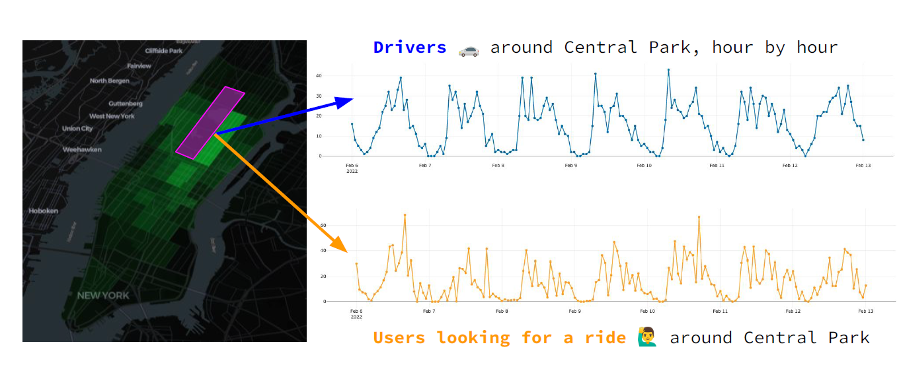
</p>

- So we need to balance both excess of drivers and lack of drivers
- So as a data scientist, your job is to make these curves as close as possible.
- You can only control the no. of drivers but not no. of users requesting for rides. Buit what you do is predict. This is where ML enters into the picture
- Imagine you'll be developing an ML model that is going to predict how many users are going to look for a taxi ride in different areas of New York at each point in time.
- If you have this model you could plan ahead and rearrange the distribution of the fleet in order to match the demand
<p align="left">
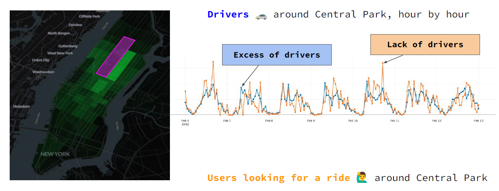
</p>

- How are we gonna build the ML model?
- We'll use historical data of taxi rides, or  more precisely, people looking for taxi ride
- But we don't have this data instead we have data of actual rides.
- The question is, can we use that info to predict what's going to happen in the next hour.
- So, at each point in time we'll have a set of historical features that we can use to generate our estimate(prediction)
- What to predict?? - What is going to happen - mo. of rides that our users will request in each area of New York city in next hour
<p align="left">
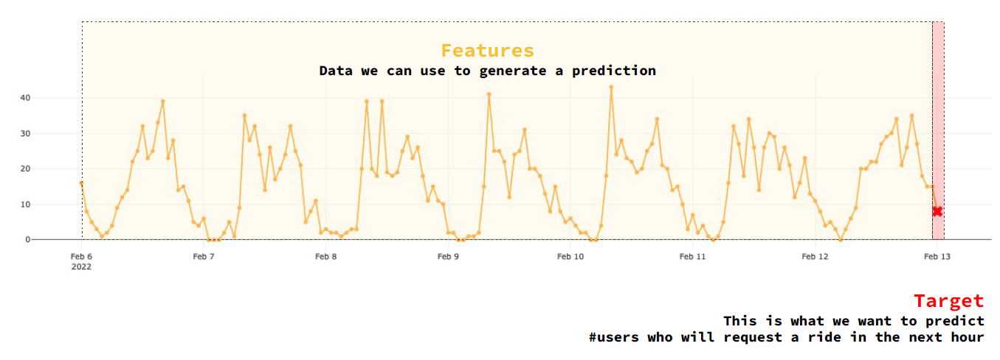
</p>


## Data Preparation

**Step 1 - Data Validation** ✔️ ❎

- Let's see the steps that take us from rare data to nice formatted data that we need to do ML
- We're gonna start with raw data that we fetch from extral website (historical taxi rides, saying certain taxi ride happend in that part of NY at that time).
- We collect at such events
- Frist thing after collecting the raw data is to validate it. You have to do this in every data pipeline i.e. make sure that the events that you're using are correct
- Features:  pickup_datetime, pickup_location_id
<p align="left">
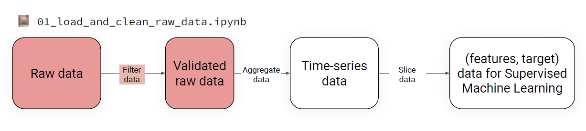
</p>


**Step 2 - Raw data into time-series data**
- Post cleaned data, we need to transform it into time-series data( aggreagate a list of raw events into time series data)
- We bucket events per hour and per area in NYC
- This way we get collection of time series data
- create new feature called `rides` = Count no. of rides per pickup_hour per pickup_location_id
- To make sure you have complete timeseries, add to missing rows for which rides didn't happen for that pickup_hour and pickup_location_id
<p align="left">
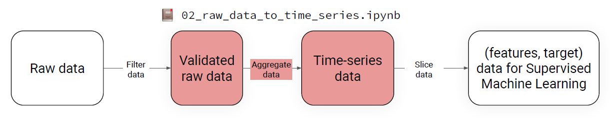
</p>


**Step 3 - Time-series data into (features, target) data**
- To apply ML, we need features and target
- We transform the TS data through slicing operations into the right format to perform supervised ML
- We take sliding window of 24 (24 hours) and use it to predict the next hour
<p align="left">
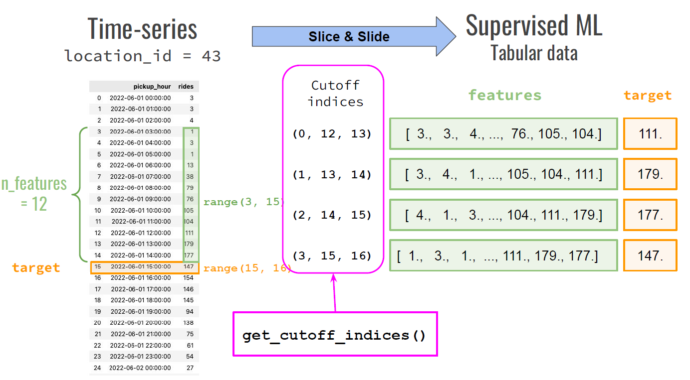
</p>

**Step 4 - From raw data to training data**
- Put the above 3 steps(notebooks) together to construct the entire `data pipeline` that is going to ingest the raw data and outputs training data that is features and targets
<p align="left">
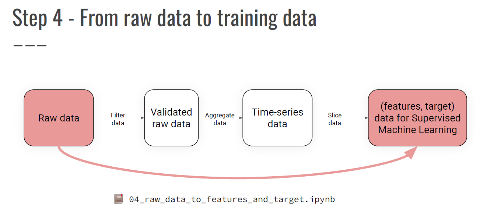
</p>

**Step 5 - Explore and visualize the final dataset**

<p align="left">
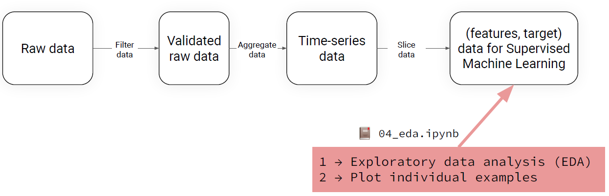
</p>


## Model training
- Split the data based on the cutoff date (since it's a time series data) into training and test data
- Create a baseline model: A simple rule that you infer just by looking at the data that uses no ML, has no complexities to obtain baseline performance
- We use MAE since it's a regression problem
- We test this baseline model on the test data (This is baseline performance)
- After baseline model, develop ML model. If the MAE of ML model is smaller to baseline model then we have built a better model. This is an iterative process by building multiple versions of the model

<p align="left">
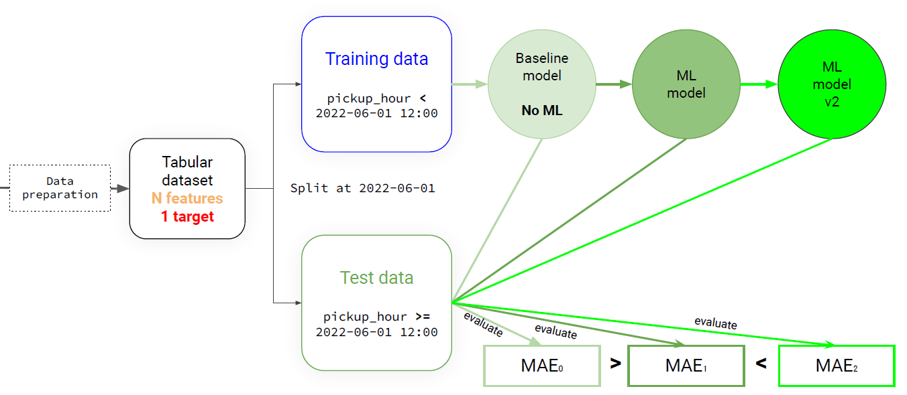
</p>

- How to build this sequence of models? (Strategies to find better models)
    - Here are 4 ways to improve your model
    - Increase training data size (if we trained 1st model on 2 yrs data, we can train new model with 1 yr of data)

<p align="left">
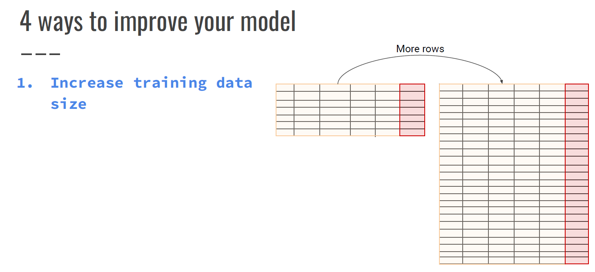
</p>
- Add more features to the training data
<p align="left">
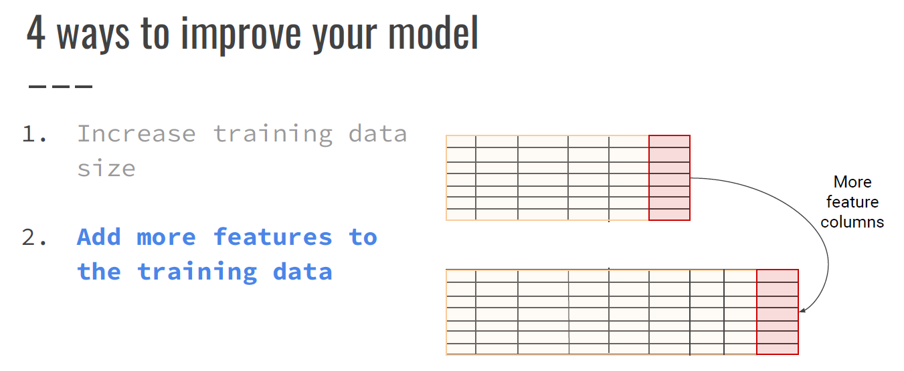
</p>
- Try powerful algorithms
<p align="left">
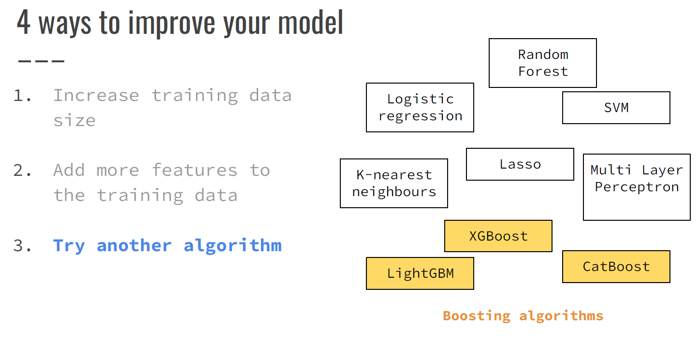
</p>
- Hyperparameter tuning
<p align="left">
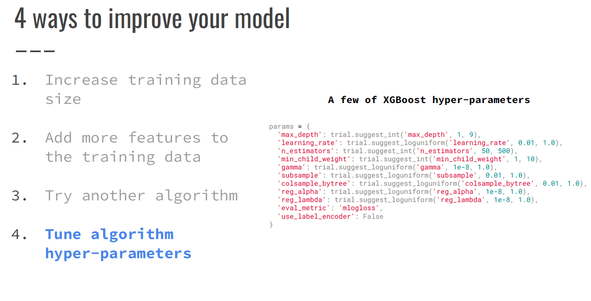
</p>
## MLOps

### Batch-scoring system 🤹

- It is a sequence of steps of computing and storage that map recent data to predictions that can be used by the business

**Step 1 - Prepare data**

- First pipeline - `Data Preparation pipeline or Feature pipeline` - This component runs every hour
- For eg: every hour, we extract raw data from an external service - from a data warehouse or wherever the recent data is
- Once we fetch raw data, we then create a tabular dataset with features and target and store them in the feature store
- This is the Data Ingestion Pipeline
  
<p align="left">
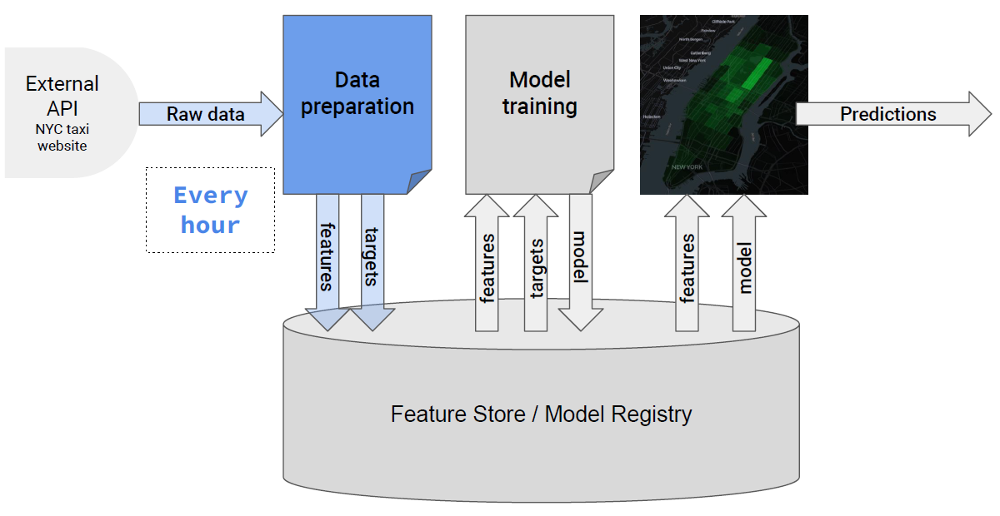
</p>

**Step 2 - Train ML Model**
- 2nd pipeline - `Model Training pipeline`
- Retrain the model since ML models in real-world systems are trained regularly
- In this project, It's on-demand, whenever I think I want to train the model, I can trigger this pipeline, and it automatically trains, generate a new model and save it back to the model registry
  
<p align="left">
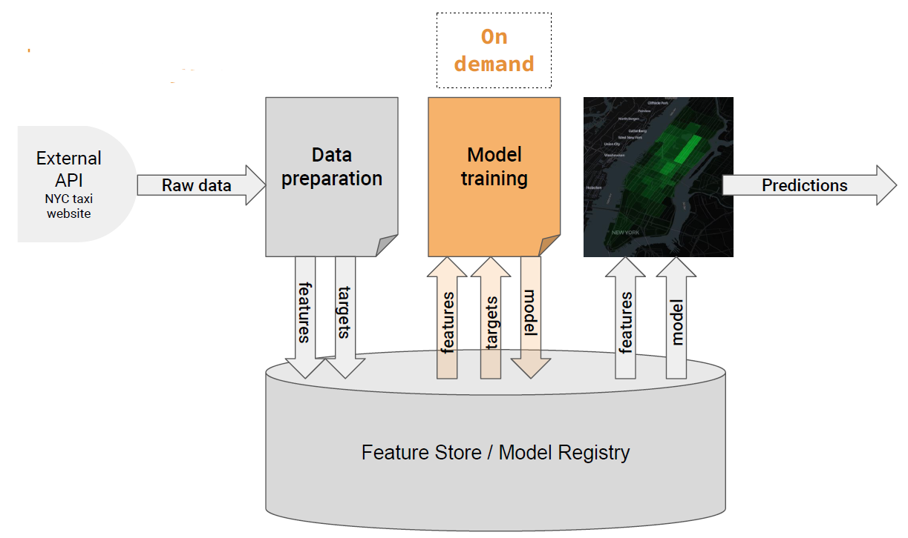
</p>

**Step 3 - Generate predictions on recent data**
- 3rd pipeline - `Prediction pipeline`
- USe most recent features and current model we have in production to generate predictions
<p align="left">
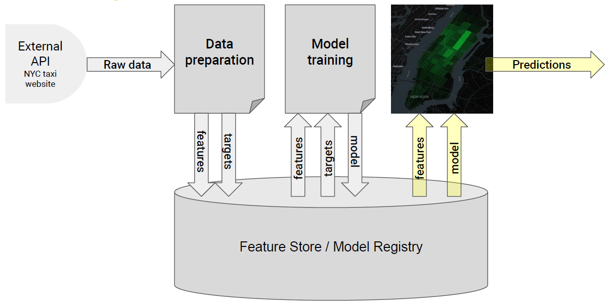
</p>


**Serverless MLOps tools**

- **`Hopsworks`** as our feature store
   - It's a serverless platform that provides an infrastructure  to manage and run the feature store automatically
   - It's easy to manage unlike GCP, Azure where we have to setup different components first

- **`Github Actions`** to schedule and run jobs
   - We automate the feature pipeline that will ingest data every hour
   - The notebook is going to automatically run every hour and it's going to fetch a batch of recent data, transform it and save it into features store
   - Created a configuration yaml file under `.github/workflows`
   - The cron job runs every hour
   - The command below triggers the notebook execution from command line

```
poetry run jupyter nbconvert -to notebook -- execute notebooks/12_feature_pipeline.ipynb
```

**Feature Store**
- Feature store is used to store features.
- These features can be used to either train the models or make predictions.
- Features saved in the feature store are:
   - `pickup_hour`
   - `no_of_rides`
   - `pickup_location_id`
     
<p align="left">
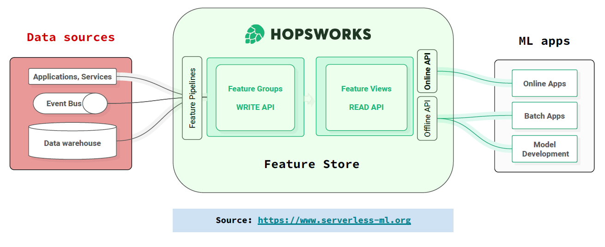
</p>


**Backfill the Feature Store**
- Fetch files from the year 2022
- Transform raw data into time series data
- Dump it in the feature store
- Repeat for the year 20223 and so on

## Live Demo
 - work in progress
